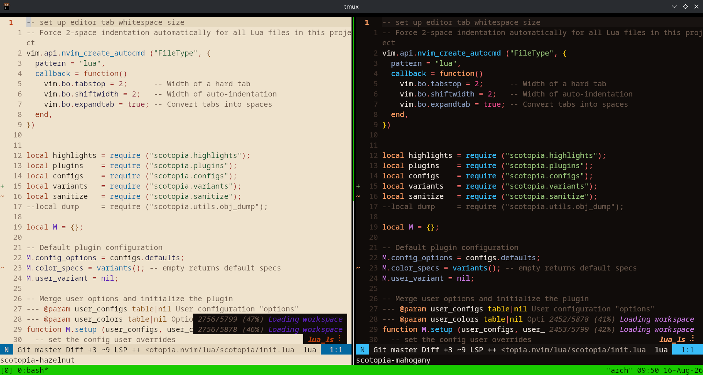

# Scotopia.nvim

<!--  -->


A vibrant, low eye strain colorscheme for Neovim, designed for focused and
comfortable long coding sessions.

> Colorful enough to make your code beautiful.
> Restrained enough to keep you focused.

Scotopia is a dark Neovim colorscheme focused on **clear semantic highlighting,
vibrant colors, and low visual fatigue**.

Instead of making every token equally prominent, Scotopia uses a deliberate
visual hierarchy:

- Functions, types, classes, structures, constants, and enums receive strong
visual emphasis.
- Keywords remain distinctive without dominating the code.
- Strings and numbers are clearly visible but less prominent.
- Operators and punctuation stay quiet yet quite visible.
- Comments are intentionally muted.

The goal is simple:

> **Make the code structure visible without making the editor visually noisy.**

---

## Features

- 🌈 Vibrant dark color palette
- 👁️ Designed for long coding sessions
- 🧠 Semantic syntax hierarchy rather than uniform highlighting
- 🌳 Tree-sitter highlighting
- 🛠️ Native LSP semantic highlighting
- 🔌 Dedicated integrations for popular Neovim plugins
- 🎨 Centralized palette and semantic color specifications
- 🧩 Modular highlight definitions
- ⚡ Lightweight Lua implementation
- 🛠️ Built around Neovim's native plugin infrastructure
- 🎯 Fine-grained control over colors and highlight assignments

### Supported integrations

Scotopia currently provides dedicated highlight definitions for:

- nvim-cmp
- gitsigns.nvim
- nvim-telescope/telescope.nvim
- nvim-treesitter
- which-key.nvim
- nvim-lspconfig / LSP UI
- neo-tree.nvim

Additional integrations can be added independently without changing the core
theme.

---

## Design

Scotopia is built around a simple pipeline:

```text
Palette
   ↓
Semantic specifications
   ↓
Highlight definitions
   ↓
Neovim highlight groups
```

## Prerequisites

Neovim 0.12.4+

*You can try out to check if it works on older versions or not*

## Installation

### Using `vim.pack` (Neovim 0.12+)

descriptive way

```lua
vim.pack.add ( 
  {
    {
      src = "https://github.com/SayanShankhari/scotopia.nvim",
      name = "scotopia",
    },
  }
);
```

or by shorthand

```lua
vim.pack.add ( { "https://github.com/SayanShankhari/scotopia.nvim" } );
```

### Using `lazy.nvim`

```lua
{
  "SayanShankhari/scotopia.nvim",
  lazy = false,
  priority = 1000,
  config = function()
    vim.cmd.colorscheme ("scotopia");
  end,
}
```

### Using `packer`

```lua
use { "SayanShankhari/scotopia.nvim" }
```

### Using `vim-plug`

```lua
Plug 'SayanShankhari/scotopia.nvim'
```

## Basic Usage

After installation inside `init.nvim`

```lua
vim.cmd.colorscheme ("scotopia");
```

Or from Vim command mode:

```vim
:colorscheme scotopia
```

or even load some variants

default dark:

```vim
:colorscheme scotopia-mahogany
```

or light variant:

```vim
:colorscheme scotopia-hazelnut
```

## Customization

Scotopia is highly customizatble, even inside initial setup call.

### Configuration

Scotopia uses two aspects of highlighting, one for basic configuration options
(normal, bold, italic, underligned, etc.) another for color soecifications (red
, green, blue, rainbow variants etc.) and those already have *fixed* set of
parameters. Please revivew them before updating the specs.

This separate palette definition from semantic highlight definitions, makes it
easy to customize the appearance without rewriting the whole highlight groups.

The main customization points are:

- `palette.lua` — theme colors -- *incomplete*
- `semantics.lua` — semantic color assignments
- `highlights/` — editor and syntax highlights
- `plugins/` — plugin-specific highlights

For example:

```lua
S.syntax = {
  keyword  = palette.purple.base,
  string   = palette.green.base,
  func     = palette.blue.base,
  type     = palette.yellow.base,
  constant = palette.orange.base,
  comment  = palette.fg2,
}
```

Feel free to assign colors according to your own preference.

## Integrations

Scotopia currently includes highlight support for:

- nvim-cmp
- gitsigns.nvim
- nvim-lspconfig / LSP
- telescope.nvim
- nvim-treesitter
- which-key.nvim
- neo-tree.nvim

More integrations may be added over time.

## Development

Scotopia is actively developed and tested in a dedicated Neovim sandbox.

To work on the theme locally yourself:

- please create a fork of it under your github account
- clone it locally
- do your changes and test according to your way

```bash
git clone https://github.com/YOUR-USERNAME/scotopia.nvim.git
cd scotopia.nvim
```

## Status

Scotopia is currently under **active development**.

The palette, highlight groups and integrations may continue to evolve
before the first stable release.

## Contributions

Contributions, suggestions and bug reports are heartly welcomed.
Looking forward to receive Issues and Pull-Requests for any major as
well as minor changes.

## License

[MIT](./LICENSE)
